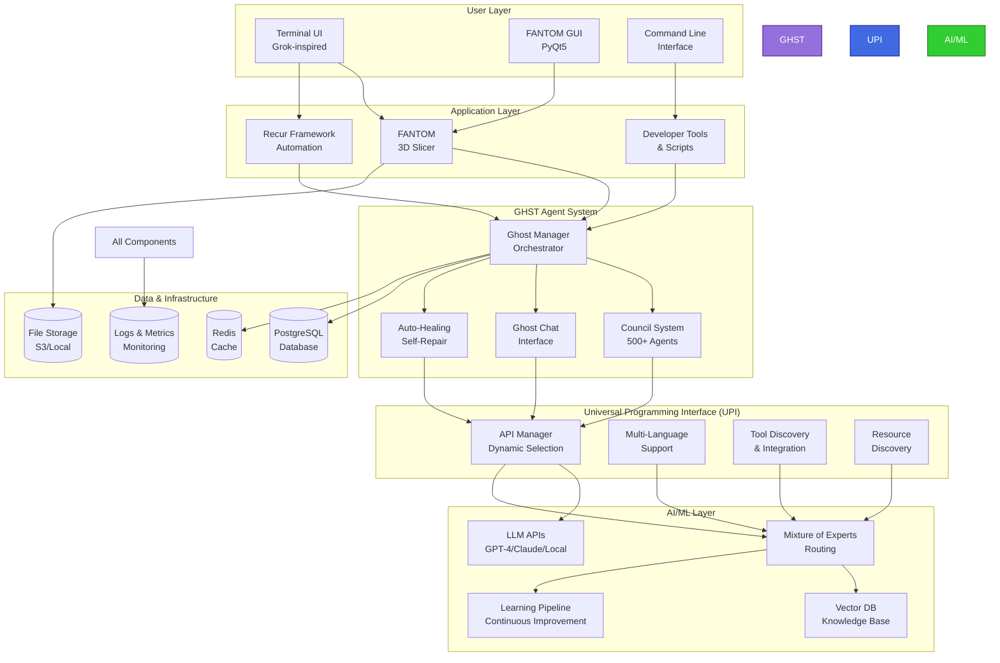
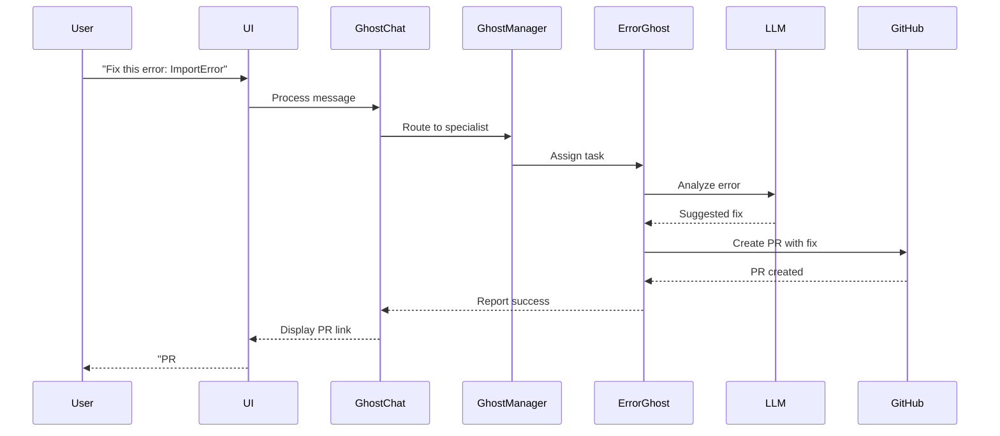
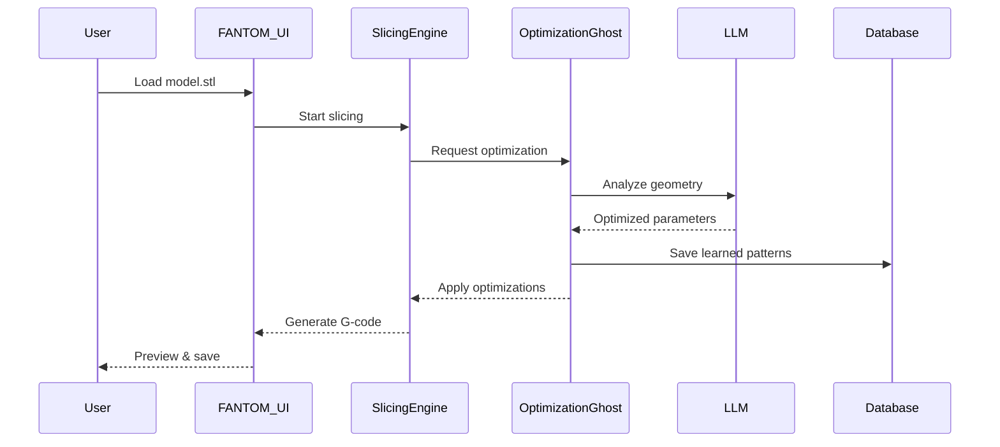
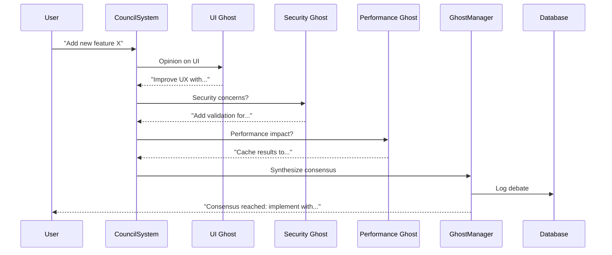

# BLEND-RECURse Architecture Vision

**A Unified AI-Driven Coding Ecosystem**

---

## 🏗️ **SYSTEM ARCHITECTURE OVERVIEW**



---

## 🧩 **COMPONENT BREAKDOWN**

### **1. User Layer**

#### **Terminal UI (Grok-Inspired)**
- Modern, polished terminal interface
- Chat, projects, image generation
- Keyboard shortcuts & accessibility
- Real-time updates & animations

#### **FANTOM GUI**
- PyQt5-based desktop application
- 3D model preview & slicing
- Material theme with customization
- Developer mode for experimental features

#### **Command Line Interface**
- Scriptable automation
- CI/CD integration
- Batch processing
- Quick operations

---

### **2. Application Layer**

#### **FANTOM 3D Slicer**
```
fantom/
├── slicer_engine/     → Core slicing algorithms (C++)
├── ui/                → PyQt5 interface
├── ai_optimization/   → AI-powered improvements
├── config/            → Printer profiles & settings
└── plugins/           → Extensibility
```

**Key Features**:
- AI-optimized slicing
- Non-planar support (experimental)
- Multi-material handling
- Ghost agent integration

#### **Recur Framework**
```
recur/
├── agents/            → Council agent personas
├── plugins/           → Modular extensions
├── api/               → Universal Programming Interface
├── ui/                → Terminal UI components
├── audits/            → Ethics & quality checks
└── automation/        → Self-healing logic
```

**Key Features**:
- Council-driven development
- Plugin ecosystem
- Ethical AI audits
- Automated workflows

#### **Developer Tools**
- Build automation
- Nightly build system
- Code cleanup utilities
- Auto-commit daemons

---

### **3. GHST Agent System**

The heart of the AI-driven development:

#### **Ghost Manager**
- Orchestrates 500+ specialized agents
- Manages council sessions
- Coordinates task distribution
- Monitors agent performance

#### **Council System**
- Think tanks for complex problems
- Multi-round debates
- Consensus building
- Decision logging for ML

#### **Ghost Chat Interface**
- Natural language interaction
- Context-aware responses
- Multi-agent collaboration
- Conversation history

#### **Auto-Healing**
- Error detection & classification
- Automated fix generation
- PR creation with disclaimers
- Continuous monitoring

**Agent Specializations**:
```
👻 Analysis Ghost      → Code review & optimization
🔧 Error Ghost         → Bug detection & fixing
⚡ Optimization Ghost  → Performance tuning
🔍 Research Ghost      → FOSS solution discovery
🎨 UI/UX Ghost         → Interface design
📚 Documentation Ghost → Docs generation
🔒 Security Ghost      → Vulnerability scanning
🧪 Testing Ghost       → Test generation
... 492+ more specialized agents
```

---

### **4. Universal Programming Interface (UPI)**

Makes GHST truly universal:

#### **API Manager**
- Dynamic LLM provider selection
- Fallback mechanisms
- Load balancing
- Cost optimization

#### **Multi-Language Support**
```python
# Example: UPI abstracts language differences
result = upi.execute(
    language="python",
    code="print('Hello')",
    environment="isolated"
)

result = upi.execute(
    language="cpp",
    code="std::cout << 'Hello';",
    environment="containerized"
)
```

#### **Tool Discovery**
- Automatic package detection
- Documentation scraping
- API schema discovery
- Integration generation

#### **Resource Discovery**
- GitHub FOSS scanning
- Stack Overflow integration
- Package repository search
- Best practices learning

---

### **5. AI/ML Layer**

Powers the intelligence:

#### **LLM APIs**
- OpenAI GPT-4 (primary)
- Anthropic Claude (alternative)
- Local models (Mistral, Llama)
- Custom fine-tuned models

#### **Mixture of Experts (MoE)**
```python
# Example: MoE routing
query = "How to optimize this Python function?"

# Router analyzes query
expert = moe_router.select_expert(query)
# Selects: "Performance Optimization Ghost"

# Expert processes with specialized knowledge
result = expert.process(query, context)
```

#### **Vector Database**
- Knowledge base storage
- Semantic search
- Context retrieval
- Conversation memory

#### **Learning Pipeline**
- Continuous learning from interactions
- Fine-tuning on project data
- A/B testing for improvements
- Performance metrics tracking

---

### **6. Data & Infrastructure**

#### **PostgreSQL Database**
- User data & preferences
- Project configurations
- Agent conversations
- Performance metrics

#### **Redis Cache**
- API response caching
- Session storage
- Real-time data
- Rate limiting

#### **File Storage**
- 3D models (STL, 3MF)
- Generated G-code
- User uploads
- Plugin assets

#### **Logs & Metrics**
- Application logs
- Agent activity logs
- Performance metrics
- Error tracking

---

## 🔄 **DATA FLOW EXAMPLES**

### **Example 1: User Asks Ghost to Fix Error**



### **Example 2: FANTOM Slices 3D Model with AI Optimization**



### **Example 3: Council Debates Feature Implementation**



---

## 🔐 **SECURITY ARCHITECTURE**

### **API Key Management**
```
Environment Variables
    ↓
API Key Vault (encrypted)
    ↓
API Manager (rotation, validation)
    ↓
LLM APIs (secure calls)
```

### **User Data Protection**
- Encrypted at rest (database)
- Encrypted in transit (TLS)
- GDPR compliant
- User data isolation
- Regular backups

### **Code Execution Safety**
- Sandboxed environments (Docker)
- Resource limits (CPU, memory)
- Network isolation
- Input validation
- Output sanitization

---

## 📈 **SCALABILITY STRATEGY**

### **Horizontal Scaling**

```
Load Balancer
    ├── GHST Instance 1 (Agents 1-100)
    ├── GHST Instance 2 (Agents 101-200)
    ├── GHST Instance 3 (Agents 201-300)
    └── GHST Instance N (Agents ...)
```

### **Caching Strategy**

```
Request
    → Check Redis Cache
        → Hit: Return cached
        → Miss: Process & Cache
```

### **Database Optimization**

```
Read Replicas (3x)
    ← Master Database
        → Write Operations
    → Read Operations (distributed)
```

---

## 🎯 **INTEGRATION POINTS**

### **External Systems**

| System | Purpose | Integration Method |
|--------|---------|-------------------|
| GitHub | PR creation, FOSS research | REST API |
| OpenAI | LLM inference | Official SDK |
| Anthropic | Claude API | Official SDK |
| PyPI | Package discovery | REST API + web scraping |
| npm | JS package discovery | REST API |
| Stack Overflow | Q&A research | Web scraping + API |
| Docker Hub | Container images | REST API |

### **Plugin Interface**

```python
class GHSTPlugin:
    """Base class for all GHST plugins"""
    
    def __init__(self, config):
        self.config = config
    
    def on_load(self):
        """Called when plugin loads"""
        pass
    
    def on_agent_message(self, message):
        """Process agent messages"""
        pass
    
    def on_error(self, error):
        """Handle errors"""
        pass
    
    def get_metadata(self):
        """Return plugin metadata"""
        return {
            "name": "Example Plugin",
            "version": "1.0.0",
            "author": "GHST Team"
        }
```

---

## 🚀 **DEPLOYMENT ARCHITECTURE**

### **Development Environment**
```
Docker Compose
├── ghst-app (main application)
├── postgres (database)
├── redis (cache)
├── nginx (reverse proxy)
└── monitoring (Prometheus + Grafana)
```

### **Production Environment**
```
Cloud Provider (AWS/GCP/Azure)
├── Kubernetes Cluster
│   ├── GHST Pods (auto-scaling)
│   ├── Database (managed service)
│   ├── Redis Cluster
│   └── Load Balancers
├── CDN (CloudFlare)
├── Object Storage (S3)
└── Monitoring (DataDog/NewRelic)
```

---

## 📊 **PERFORMANCE TARGETS**

| Metric | Target | Phase |
|--------|--------|-------|
| Response Time (Agent) | < 2s | Phase 1 |
| Response Time (Slicing) | < 30s | Phase 3 |
| Concurrent Users | 1,000+ | Phase 7 |
| Agent Capacity | 500+ | Phase 1 |
| Uptime | 99.9% | Phase 7 |
| API Success Rate | 95%+ | Phase 1 |
| Test Coverage | 90%+ | Phase 6 |

---

## 🔮 **FUTURE ARCHITECTURE**

### **Phase 8+ Enhancements**

1. **Distributed Agents**
   - Agents running on user devices
   - Peer-to-peer agent communication
   - Federated learning

2. **Advanced AI**
   - Custom trained models
   - Multi-modal agents (text, image, video)
   - Real-time voice interaction

3. **Blockchain Integration**
   - Immutable audit trails
   - Token economy for contributors
   - Decentralized governance

4. **Edge Computing**
   - Local-first architecture
   - Offline capabilities
   - Privacy-preserving computation

---

## 💡 **ARCHITECTURAL PRINCIPLES**

1. **Modularity** - Every component is replaceable
2. **Scalability** - Horizontal scaling by default
3. **Extensibility** - Plugin system for customization
4. **Testability** - High coverage, automated testing
5. **Security** - Defense in depth
6. **Performance** - Caching, async, optimization
7. **Reliability** - Error handling, monitoring, alerts
8. **Documentation** - Every API documented
9. **Openness** - FOSS, transparent, community-driven
10. **Ethics** - AI safety, user privacy, responsible development

---

## 📚 **RELATED DOCUMENTS**

- [PROJECT_GOAL_AND_ROADMAP.md](./PROJECT_GOAL_AND_ROADMAP.md) - Full roadmap
- [ROADMAP_QUICK_REFERENCE.md](./ROADMAP_QUICK_REFERENCE.md) - Quick guide
- [PHASE_0_ACTION_PLAN.md](./PHASE_0_ACTION_PLAN.md) - Getting started
- [CONTRIBUTING.md](./CONTRIBUTING.md) - How to contribute
- [API_REFERENCE.md](./docs/API_REFERENCE.md) - API documentation

---

*Architecture Vision Version: 1.0*  
*Living document - will evolve with the project*  
*Last Updated: 2025*
