# Recur Framework

A next-generation, council-driven, self-healing, ethical automation and learning system. Powered by a Mixture of Experts (MoE), recursive agents, and a universal API.

---

## 🥇 Raspberry Pi Handbook: MoE Ghost Teams Flow Chart

> **Theme:** Glossy white background, professional layout, emoji accents for clarity and energy.

---

### 📊 MoE Ghost Teams Flow Chart

```mermaid
flowchart TD
	subgraph Team_Alpha["🟣 Team Alpha Ghosts (Coding & Automation)"]
		A1["👾 Code Architect"]
		A2["🛠️ Buildmaster"]
		A3["🧠 Algorithmist"]
		A4["🦾 Integrationist"]
		A5["🦉 Debug Sage"]
		A6["🧩 Modularist"]
		A7["🦸‍♂️ Security Ghost"]
		A8["🦄 UI/UX Designer"]
	end

	subgraph Team_Beta["🟡 Team Beta Ghosts (Research & Brainstorming)"]
		B1["📚 Lorekeeper"]
		B2["🧬 Data Ghost"]
		B3["🦉 Ethics Auditor"]
		B4["🧑‍🔬 Fact Checker"]
		B5["🧙‍♂️ Brainstormer"]
		B6["🦾 Automation Ghost"]
		B7["🦸‍♀️ Community Builder"]
		B8["🦜 Emoji Master"]
	end

	A1 --> A2 --> A3 --> A4 --> A5 --> A6 --> A7 --> A8
	B1 --> B2 --> B3 --> B4 --> B5 --> B6 --> B7 --> B8
	A8 --- B8
	A7 --- B3
	A6 --- B6
	A5 --- B2
	A4 --- B4
	A3 --- B5
	A2 --- B7
	A1 --- B1
```

---

### 📘 How to Use This Handbook

- **Glossy White Background:** For best results, use a Markdown viewer or documentation site with a white/light theme.
- **Emoji Accents:** Each Ghost agent’s role is visually marked for quick reference.
- **Professional Layout:** Teams are grouped for parallel collaboration, with cross-team links for synergy.

---

> **Tip:** Copy the Mermaid code above into your documentation or a Markdown file. Use a viewer that supports Mermaid diagrams (like VS Code with the Markdown Preview Mermaid plugin) for a beautiful, interactive flow chart.

---

## Structure
- agents/: Council agents, personas, self-healing logic
- plugins/: Modular plugin system, grafts, extensions
- api/: Universal Programming Interface (UPI), endpoints
- ui/: Modern dark mode React UI, gamified dashboard
- audits/: Ethics, bias, and quality audit logic
- docs/: Technical, lore, onboarding documentation
- tests/: Automated tests
- build/: Build scripts, speedbuild cycles
- config/: YAML/JSON configuration files
- logs/: Council, ML, and audit logs

---
See docs/ for full lore, onboarding, and council grafting guides.
